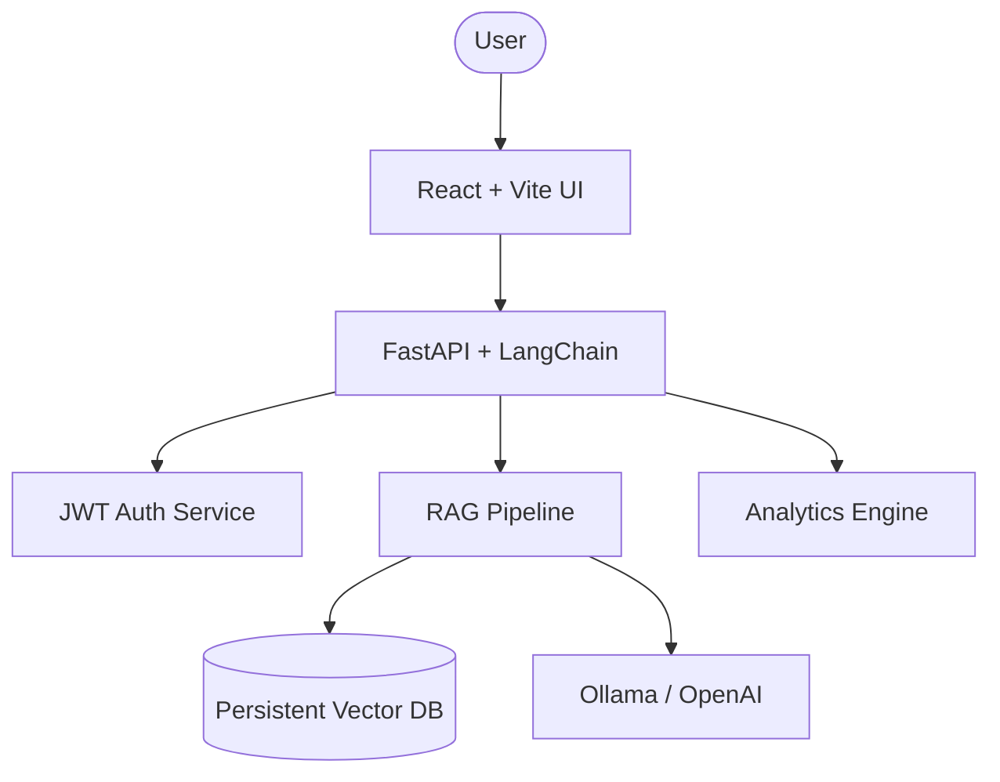

# 🧠 Enterprise RAG Platform

A production-grade **Retrieval-Augmented Generation** system for enterprise document intelligence. Query internal documents — HR policies, financial reports, legal contracts, compliance docs — using AI.

[](https://opensource.org/licenses/MIT)


## ✨ Features

- 🤖 **Neural Search**: Semantic document retrieval using local embeddings.
- 🎙️ **Intelligence Feed**: Real-time notifications for system events and alerts.
- ⚙️ **Live Tuning**: Reconfigure RAG parameters (top-k, chunking) in real-time.
- � **Secure Access**: JWT-based authentication with role-based dashboard views.
- 📊 **Insight Analytics**: Comprehensive tracking of query trends and latency.

## 🏗️ Architecture



## 🚀 Quick Start

### Prerequisites

- **Node.js** v18+
- **Python** 3.11+
- **Ollama** (for local models)

### 1. Project Setup

```bash
git clone <repo-url>
cd enterprise-rag-systems
cp .env.example .env  # Update your keys
```

### 2. Run with Docker (Recommended)

```bash
docker-compose up --build
```

### 3. Manual Startup

**Backend:**

```bash
cd backend
python -m venv .venv
# Activate: .\ .venv\Scripts\Activate on Windows
pip install -r requirements.txt
python -m uvicorn api.main:app --reload
```

**Frontend:**

```bash
cd frontend
npm install
npm run dev
```

## 🛡️ Production Hardening

This project is configured for reliability:

- **Health Monitoring**: Check service status at `/api/health`.
- **Structured Logging**: Configurable log levels via environment variables.
- **Security**: Docker containers run as non-root users; CORS is restricted to allowed origins.
- **Persistence**: Sidecar JSON storage ensures settings survive restarts.

## 📄 License

Distributed under the MIT License. See `LICENSE` for more information.
