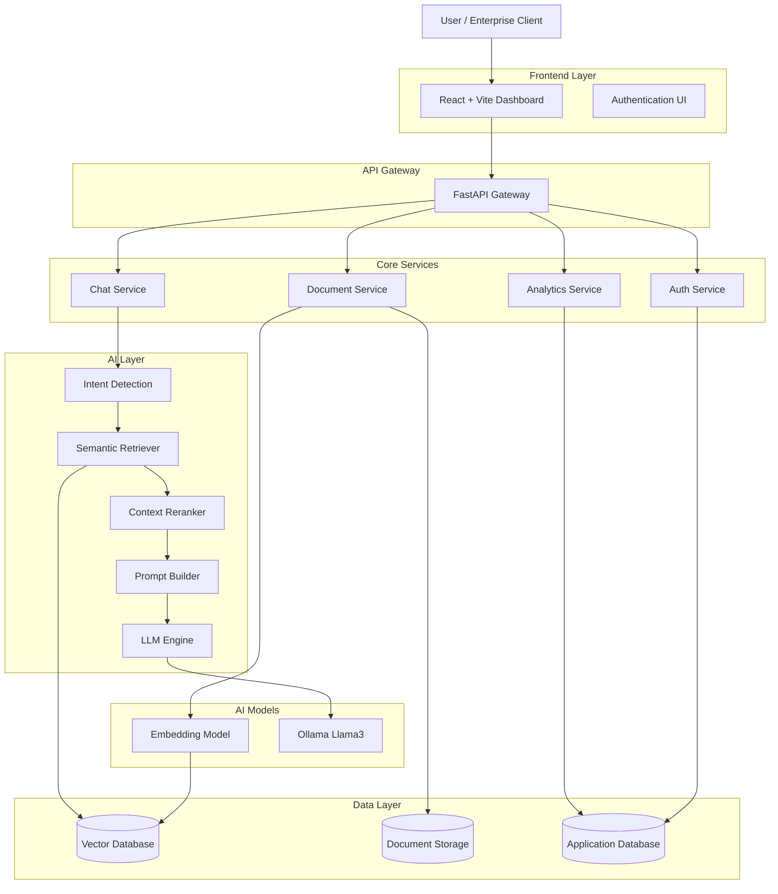
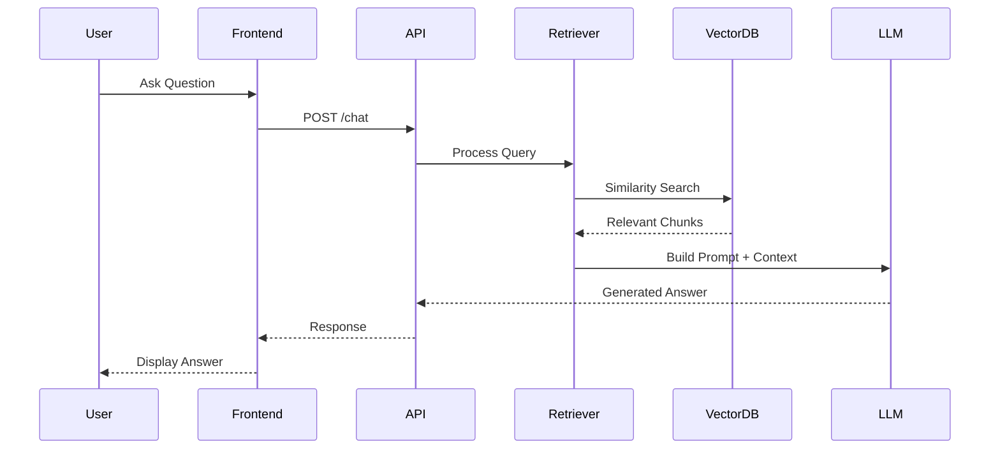

<h1 align="center">🧠 Nexus AI</h1>
<h3 align="center">Enterprise RAG Intelligence Platform</h3>

<p align="center">
AI-powered enterprise knowledge system built with <b>Retrieval-Augmented Generation</b>.
</p>

<p align="center">


</p>

<p align="center">
⚡ Semantic Search • 🧠 AI Reasoning • 📊 Enterprise Analytics • 📄 Document Intelligence
</p>
A **production-grade Retrieval-Augmented Generation (RAG) platform** designed for **enterprise document intelligence**.

Query internal company knowledge such as:

- 📄 HR policies  
- ⚖️ Legal contracts  
- 📊 Financial reports  
- 🔐 Compliance documentation  
- 📚 Internal knowledge bases  

The platform provides **AI-powered document understanding**, enabling organizations to search, summarize, and analyze internal knowledge using a modern AI interface.

---

# ✨ Platform Overview

Nexus AI transforms static enterprise documents into **interactive AI knowledge systems**.

It combines:

- Vector Search
- Large Language Models
- Semantic Embeddings
- Enterprise Analytics

to deliver **accurate AI answers grounded in company data**.

---

# 🚀 Key Features

| Feature | Description |
|--------|-------------|
| 🤖 **AI Knowledge Chat** | Conversational interface for enterprise documents |
| 🧠 **Hybrid RAG Engine** | Combines vector retrieval + LLM reasoning |
| 📄 **Multi-Document Support** | PDF, DOCX, TXT, CSV |
| 🎙️ **Voice Queries** | Speech-to-text chat input |
| 📎 **Instant File Indexing** | Upload documents directly in chat |
| 📊 **Enterprise Analytics** | Query metrics + document insights |
| 🎨 **Premium UI** | Glassmorphism dashboard interface |
| 🔐 **Secure Authentication** | JWT-based access control |

---

# 🖥️ Platform Interface

## Intelligence Hub Dashboard

Displays:

- Document statistics
- Query analytics
- System latency
- RAG recall performance

## Neural Chat Interface

Features:

- conversational AI interface
- document source citations
- voice query support
- document attachment

---

# 🏗️ System Architecture

## Query Processing Flow


# ⚙️ Tech Stack

## Frontend

- React
- Vite
- TypeScript
- TailwindCSS
- ShadCN UI
- Framer Motion

---

## Backend

- FastAPI
- LangChain
- SentenceTransformers
- Pydantic

---

## AI Stack

| Component | Technology |
|-----------|------------|
| LLM | Llama 3 via Ollama |
| Embeddings | BAAI/bge-base-en-v1.5 |
| Vector Database | DuckDB |
| RAG Framework | LangChain |

---

# 📂 Project Structure
```
enterprise-rag-platform
│
├── frontend
│ ├── src
│ │ ├── components
│ │ ├── pages
│ │ ├── store
│ │ ├── services
│ │ └── lib
│
├── backend
│ ├── api
│ ├── rag
│ ├── ingestion
│ ├── embeddings
│ ├── services
│ └── models
│
├── data
│ └── samples
│
├── vector_db
│
├── docker
│
├── tests
│
├── docker-compose.yml
└── .env.example
```

---
### Development Setup Guide
## Prerequisites

- Python 3.9+
- Node.js 18+
- npm

---

## 1️⃣ Backend Environment Initialization

```bash
cd backend
python -m venv .venv
```

---

## 2️⃣ Configuration & Environment Variables

```bash
# From project root
copy .env.example .env

# Sync environment file to backend
copy .env backend\.env
```

---

## 3️⃣ Frontend Dependency Installation

```bash
cd frontend
npm install --legacy-peer-deps
```

---

## 4️⃣ Backend Dependency Installation & Bug Fixes

```bash
cd backend

# Install core backend dependencies
.\.venv\Scripts\python -m pip install fastapi uvicorn python-multipart

# Install remaining dependencies from requirements file
.\.venv\Scripts\python -m pip install -r requirements.txt

# Fix for missing LangChain Ollama integration
.\.venv\Scripts\python -m pip install langchain-ollama
```

> **Note:** The final pip install resolves the missing `langchain-ollama` dependency error encountered during backend startup.

## 5️⃣ Running the Services

### Start Backend API

```bash
cd backend
.\.venv\Scripts\python -m uvicorn api.main:app --reload --port 8000
```

| Service | URL |
|---|---|
| Backend API | http://localhost:8000 |
| API Docs (Swagger) | http://localhost:8000/docs |


### Start Frontend Application

```bash
cd frontend
npm run dev
```

| Service | URL |
|---|---|
| Frontend Interface | http://localhost:3000 |

## Quick Reference

| Step | Command |
|---|---|
| Create venv | `cd backend && python -m venv .venv` |
| Setup env | `copy .env.example .env` |
| Install frontend | `cd frontend && npm install --legacy-peer-deps` |
| Install backend | `cd backend && .\.venv\Scripts\python -m pip install -r requirements.txt` |
| Run backend | `cd backend && .\.venv\Scripts\python -m uvicorn api.main:app --reload --port 8000` |
| Run frontend | `cd frontend && npm run dev` |

---
# 🚀 Installation Guide

## Clone Repository

```bash
git clone https://github.com/yourusername/nexus-ai-rag.git
cd nexus-ai-rag
```
Windows
```
.\.venv\Scripts\activate
```
Linux / Mac
```
source .venv/bin/activate
```
## Install dependencies:
```
pip install -r requirements.txt
```
## Run backend:
```
uvicorn api.main:app --reload --port 8000
```
## Backend API:
```
http://localhost:8000
```
## API Docs:
```
http://localhost:8000/docs
```

## Frontend Setup
```
cd frontend
npm install
npm run dev
```
Frontend:
```
http://localhost:3000
```

## 🐳 Docker Deployment

Run the entire platform:
```
docker-compose up --build
```
This launches:
-> frontend
-> backend
-> vector database
-> AI services

## ⚙️ Environment Variables

Create .env from .env.example.
Example:
```
OPENAI_API_KEY=
JWT_SECRET=super_secret_key
VECTOR_DB_PATH=./vector_db
DATABASE_URL=sqlite:///./data/rag.db
```

## 📘 API Endpoints

| Method | Endpoint | Description |
|------|------|-------------|
| POST | `/api/chat/` | Query AI assistant |
| POST | `/api/documents/upload` | Upload documents |
| GET | `/api/documents/` | List all documents |
| DELETE | `/api/documents/{id}` | Delete a document |
| GET | `/api/analytics/stats` | Retrieve system analytics |
| POST | `/api/auth/login` | Authenticate user and obtain JWT token |

---

## 🧪 Testing

Run backend tests:

```bash
cd backend
pytest tests/
```

## ⚡ Performance Optimizations

### Vector Search Optimization
- Semantic embeddings for accurate retrieval
- Similarity threshold filtering
- Top-K document retrieval

### Context Optimization
- Document chunking strategy
- Context compression
- Optimized prompt engineering

### AI Pipeline Improvements
- Hybrid RAG routing
- Context reranking
- Query intent classification

---

## 📈 Scalability Strategy

| Layer | Scaling Method |
|------|----------------|
| Frontend | CDN + static hosting |
| Backend | Horizontal scaling with load balancing |
| Vector DB | Distributed vector storage |
| LLM | Local inference or cloud scaling |

---

## ⚙️ Caching Strategy

| Cache Type | Purpose |
|-----------|---------|
| Query Cache | Store previous responses |
| Embedding Cache | Reuse computed embeddings |
| Document Cache | Store processed document chunks |
| Model Cache | Keep LLM loaded in memory |

---

## 🔐 Authentication

The platform supports **Role-Based Access Control (RBAC)**.

| Role | Permissions |
|------|-------------|
| Admin | Full system control |
| Manager | Document management + analytics |
| Employee | Chat access + document search |

---

## 🔮 Future Roadmap

Planned improvements include:

- Hybrid search (BM25 + vector search)
- RAG reranking with cross-encoders
- Query intent detection
- Graph-based RAG architecture
- Multi-agent AI reasoning
- Enterprise SSO integration
