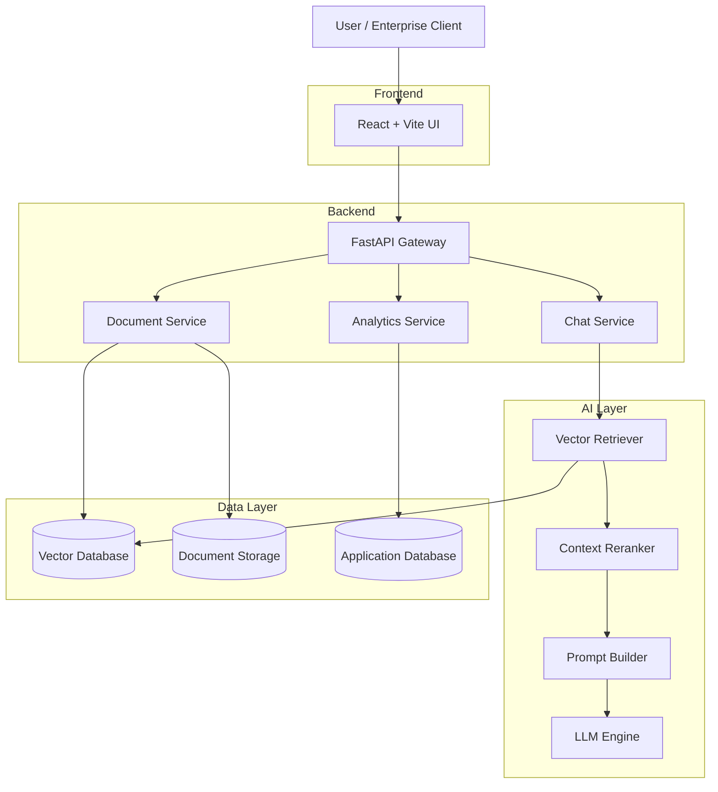

<h1 align="center"> Nexus AI — Enterprise RAG Intelligence Platform </h1>

A **production-grade Retrieval-Augmented Generation (RAG) platform** designed for **enterprise document intelligence**.

Query internal company knowledge such as:

- 📄 HR policies  
- ⚖️ Legal contracts  
- 📊 Financial reports  
- 🔐 Compliance documentation  
- 📚 Internal knowledge bases  

The platform provides **AI-powered document understanding**, enabling organizations to search, summarize, and analyze internal knowledge using a modern AI interface.

---

# ✨ Platform Overview

Nexus AI transforms static enterprise documents into **interactive AI knowledge systems**.

It combines:

- Vector Search
- Large Language Models
- Semantic Embeddings
- Enterprise Analytics

to deliver **accurate AI answers grounded in company data**.

---

# 🚀 Key Features

| Feature | Description |
|--------|-------------|
| 🤖 **AI Knowledge Chat** | Conversational interface for enterprise documents |
| 🧠 **Hybrid RAG Engine** | Combines vector retrieval + LLM reasoning |
| 📄 **Multi-Document Support** | PDF, DOCX, TXT, CSV |
| 🎙️ **Voice Queries** | Speech-to-text chat input |
| 📎 **Instant File Indexing** | Upload documents directly in chat |
| 📊 **Enterprise Analytics** | Query metrics + document insights |
| 🎨 **Premium UI** | Glassmorphism dashboard interface |
| 🔐 **Secure Authentication** | JWT-based access control |

---

# 🖥️ Platform Interface

## Intelligence Hub Dashboard

Displays:

- Document statistics
- Query analytics
- System latency
- RAG recall performance

## Neural Chat Interface

Features:

- conversational AI interface
- document source citations
- voice query support
- document attachment

---

# 🏗️ System Architecture

⚙️ Tech Stack
Frontend

React

Vite

TypeScript

TailwindCSS

ShadCN UI

Framer Motion

Backend

FastAPI

LangChain

SentenceTransformers

Pydantic

AI Stack
Component	Technology
LLM	Llama 3 via Ollama
Embeddings	BAAI/bge-base-en-v1.5
Vector Database	DuckDB
RAG Framework	LangChain
📂 Project Structure
enterprise-rag-platform
│
├── frontend
│   ├── src
│   │   ├── components
│   │   ├── pages
│   │   ├── store
│   │   ├── services
│   │   └── lib
│
├── backend
│   ├── api
│   ├── rag
│   ├── ingestion
│   ├── embeddings
│   ├── services
│   └── models
│
├── data
│   └── samples
│
├── vector_db
│
├── docker
│
├── tests
│
├── docker-compose.yml
└── .env.example
🚀 Installation Guide
1️⃣ Clone Repository
git clone https://github.com/yourusername/nexus-ai-rag.git

cd nexus-ai-rag
🛠️ Backend Setup
cd backend

python -m venv .venv

# Windows
.\.venv\Scripts\activate

# Linux/Mac
source .venv/bin/activate

pip install -r requirements.txt

uvicorn api.main:app --reload --port 8000

Backend API:

http://localhost:8000

API Docs:

http://localhost:8000/docs
💻 Frontend Setup
cd frontend

npm install

npm run dev

Frontend:

http://localhost:3000
🐳 Docker Deployment

Run the entire platform with one command:

docker-compose up --build

This launches:

frontend

backend

vector database

AI services

⚙️ Environment Variables

Create .env from .env.example.

Example:

OPENAI_API_KEY=

JWT_SECRET=super_secret_key

VECTOR_DB_PATH=./vector_db

DATABASE_URL=sqlite:///./data/rag.db
📘 API Endpoints
Method	Endpoint	Description
POST	/api/chat/	Query AI assistant
POST	/api/documents/upload	Upload documents
GET	/api/documents/	List documents
DELETE	/api/documents/{id}	Delete document
GET	/api/analytics/stats	System analytics
POST	/api/auth/login	Authenticate user
🧪 Testing

Run backend tests:

cd backend

pytest tests/
⚡ Performance Optimizations
Vector Search Optimization

semantic embeddings

similarity threshold filtering

top-k retrieval

Context Optimization

document chunking strategy

context compression

optimized prompts

AI Pipeline Improvements

hybrid RAG routing

reranking

query classification

📈 Scalability Strategy
Layer	Scaling Method
Frontend	CDN + static hosting
Backend	Horizontal scaling
Vector DB	Distributed vector storage
LLM	Local inference or cloud scaling
⚙️ Caching Strategy
Cache Type	Purpose
Query Cache	store previous responses
Embedding Cache	reuse embeddings
Document Cache	store processed chunks
Model Cache	keep LLM loaded in memory
🔐 Authentication

The platform supports role-based access.

Role	Permissions
Admin	Full access
Manager	Document + analytics
Employee	Chat + knowledge base
🔮 Future Roadmap

Upcoming upgrades include:

Hybrid search (BM25 + vector)

RAG reranking

Query intent detection

Graph RAG architecture

Multi-agent AI reasoning

Enterprise SSO support

🤝 Contributing

Contributions are welcome!

Fork repository
Create feature branch
Commit changes
Open pull request
📄 License

MIT License
